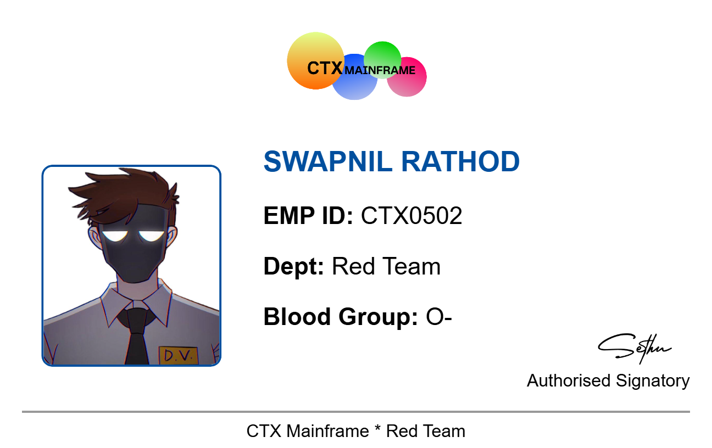
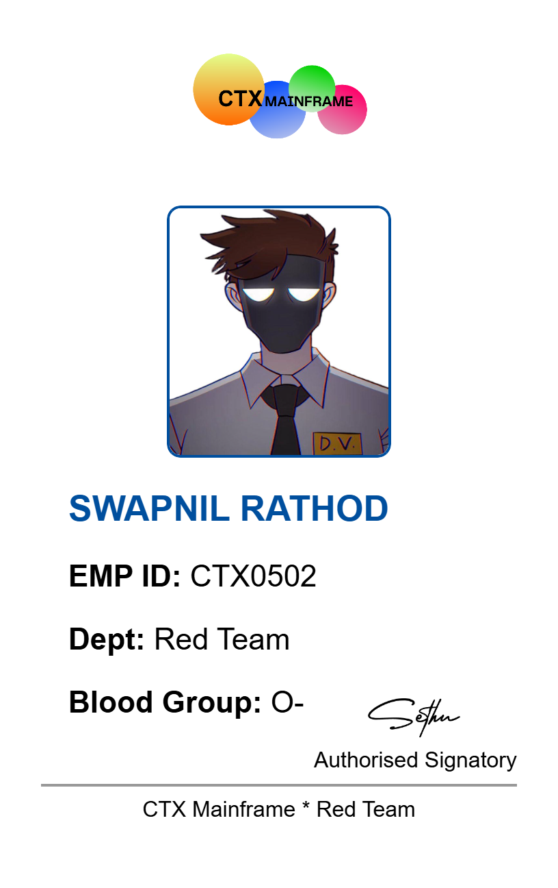

# 🪪 ID Card Generator (HTML + CSS + JavaScript)

A browser-based ID Card Generator that lets you **upload images**, switch between **vertical and horizontal layouts**, and **download high-quality PNG ID cards** — all in a single `.html` file!

---

## 🎯 Features

- ✅ Upload **Photo**, **Company Logo**, and **Signature**
- ✅ Switch between **Vertical** and **Horizontal** layout styles
- ✅ Customize fields: Name, Employee ID, Department, Blood Group, Footer
- ✅ Real-time **Live Preview**
- ✅ **Download as PNG** (high-resolution)
- ✅ Built using only **HTML**, **CSS**, and **Vanilla JavaScript**

---

## 🖼 Preview

---

## 🚀 How to Use

1. 📂 Open [ID_Card_Generator](https://swapnilr07.github.io/ID-Card-Generator/) in any modern browser.
2. ✍️ Fill in your Name, ID, Department, etc.
3. 📸 Upload a Photo, Logo, and Signature image.
4. 🔄 Click **Update** to see the preview.
5. 📥 Click **Download** to save the final ID card as PNG.

---

---

## ⚠️ Disclaimer

This project is strictly for **educational and demonstration purposes** only.  
The creator is **not responsible** for any misuse or illegal use of this tool.

---

## 👤 Creator

**Swapnil Rathod**  
Follow on:
- [Instagram](https://instagram.com)
- [YouTube](https://youtube.com)
- [GitHub](https://github.com)

---

